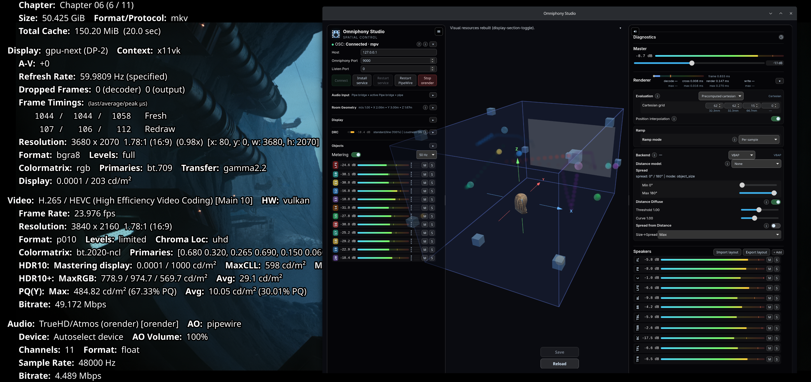

# mpv-omniphony

mpv with a **spatial audio decoder** that renders objects through
[`liborender`](https://github.com/mgth/Omniphony) (VBAP spatial rendering)
instead of letting FFmpeg downmix. Non-spatial audio keeps playing via
mpv's normal `ad_lavc` decoder.



*Left: mpv's stats overlay shows `ad_orender` picked up the stream and
the renderer is feeding the platform's audio output. Right: Omniphony
Studio attached over OSC, showing per-object positions in the room and
live meters.*

This repo holds **only** the mpv-side integration: the decoder source
(`src/ad_orender.c`), the patches that wire it into the mpv build, packaging and
CI. The renderer itself (`liborender.so` + the decoder bridge) is built
and packaged from the `Omniphony` repo (`packaging/arch/`).

## Layout

```
src/ad_orender.c        # readable copy of the decoder (patch 0001 adds it to mpv)
patches/                # generated diffs vs. pinned mpv v0.41.0
patches-master/         # generated diffs vs. upstream mpv master HEAD (live tracker)
scripts/apply-patches.sh             # clone pinned mpv + apply patches/
scripts/apply-patches-master.sh      # clone mpv master HEAD + apply patches-master/
scripts/regenerate-patches.sh        # rebuild patches/ from the fork's `orender`
scripts/regenerate-patches-master.sh # rebuild patches-master/ from `orender-master`
meson-options.txt       # canonical `orender` meson feature option
packaging/PKGBUILD          # Arch package against v0.41.0 (provides/conflicts mpv)
packaging/PKGBUILD-master   # Arch -git package tracking master HEAD
.github/workflows/ci.yml             # weekly drift check on v0.41.0
.github/workflows/build-master.yml   # daily smoke test on master HEAD
```

## How it fits together

1. mpv demuxes raw access units from the container.
2. `ad_orender` feeds them to `liborender` (`orender_process`), which loads the
   decoder bridge plugin, decodes to PCM + object metadata, and VBAP-
   renders to N-channel interleaved float (`AF_FORMAT_FLOAT` — so mpv's normal
   resampler / audio filter chain still applies, unlike spdif passthrough).
3. It's opt-in: the decoder is only selected when `orender` is in the
   `--ad` list, so default playback is untouched. The first packet
   resolves spatial-vs-plain (`orender_is_spatial`); for non-spatial streams
   the bed is still VBAP-rendered to the layout (automatic fallback to
   `ad_lavc` is a future refinement — use plain `--ad=` to bypass orender
   entirely).
4. The output channel map comes from `orender_channel_layout` (per-speaker
   labels → `mp_chmap`).

## Requirements

- `liborender >= 0.2` and the decoder bridge installed (the `liborender` +
  `omniphony-bridge` packages).
- The **shared omniphony config** at `~/.config/omniphony/config.yaml` (the same
  one the `orender` CLI and studio use) providing `render.bridge_path` (the
  decoder bridge) and optionally the speaker layout. ad_orender reads this
  config — nothing is hardcoded. If you already run the CLI/studio, it works as
  is; otherwise create it with at least:
  ```yaml
  render:
    bridge_path: /usr/lib/orender/*_bridge.so
  ```

## Build (dev)

```sh
# 1. assemble a patched mpv tree at build/mpv-v0.41.0 (clones the pinned tag):
scripts/apply-patches.sh v0.41.0

# 2. build it (needs liborender + the bridge installed):
cd build/mpv-v0.41.0
meson setup _b -Dorender=enabled && meson compile -C _b

# (to refresh patches/ after editing the fork's `orender` branch:)
scripts/regenerate-patches.sh /path/to/mpv-fork v0.41.0
```

## Play

```sh
mpv --ad=orender film.spatial.mkv          # opt-in; default playback is untouched
```

With no options, everything (bridge path, speaker layout, OSC) comes from the
shared `~/.config/omniphony/config.yaml`. Per-invocation overrides:

| Option | Overrides |
| --- | --- |
| `--ad-orender-config=<path>` | the render config YAML (else the shared default) |
| `--ad-orender-bridge-path=<path>` | `render.bridge_path` (the decoder bridge `.so`) |
| `--ad-orender-osc` | force OSC on (else follows `render.osc` in the config) |
| `--ad-orender-osc-port=<n>` | outgoing/monitoring port |
| `--ad-orender-osc-rx-port=<n>` | incoming control port (studio registers here; default 9000) |
| `--ad-orender-osc-bind=<addr>` | listener bind address |
| `--ad-orender-osc-monitor-target=<host>` | monitoring host |

Empty/zero values fall back to the config then the built-in defaults, so the
zero-config `--ad=orender` path is unchanged. **OSC + studio:** either set
`render.osc: true` in the config or pass `--ad-orender-osc`; the renderer then
listens on 9000 (the rendezvous studio registers to) — studio connects on its
own. Note the shared config means the standalone CLI would also enable OSC.

## Supervision with Omniphony Studio

[Omniphony Studio](https://github.com/mgth/Omniphony) is the 3D
visualization / live-control UI for the renderer. It speaks OSC to whichever
host runs `liborender` — the standalone `orender` CLI, or the embedded
host inside this mpv build. Studio detects the embedded variant via the
renderer's capabilities handshake and hides the panels that don't apply
(audio-output device, adaptive resampler, latency target), keeping spatial
controls and metering enabled.

### Get Studio

Prebuilt bundles ship on the Omniphony repo's releases page:

[Omniphony Studio Latest Release](https://github.com/mgth/Omniphony/releases/latest)

- **Linux** — `Omniphony.Studio_<ver>_amd64.deb`,
  `Omniphony.Studio_<ver>_amd64.AppImage`, or
  `Omniphony.Studio-<ver>-1.x86_64.rpm`.
- **Windows** — `Omniphony.Studio_<ver>_x64-setup.exe` (NSIS) or
  `Omniphony.Studio_<ver>_x64_en-US.msi`.

The Linux .deb installs an `omniphony-studio` binary; the Windows
installers add a Start menu entry.

### Connect Studio to mpv

1. Start mpv with OSC on (one of the two — they're equivalent):
   - add `render.osc: true` to `~/.config/omniphony/config.yaml`, or
   - launch with `mpv --ad=orender --ad-orender-osc film.mkv`.
2. Launch Studio. It registers with the renderer on the rendezvous port
   (default 9000) and starts receiving the live state.

Studio also works against the standalone CLI the same way — the same shared
config drives both. You can flip between embedded (mpv) and standalone
sessions without re-configuring Studio.

### Live overlay (optional)

Studio can also draw a pseudo-3D front-view diagram of the live audio
objects **directly on top of the mpv video**, mirroring the 3D view's
mapping so the two stay readable side-by-side.

What gets drawn:

- **Active objects**: filled circles at `(X, Z)`; radius from RMS level,
  per-object colour from Studio's palette (FNV-1a hash of the object id,
  with the speaker-tag override applied — same logic as the 3D view).
- **Wireframe cube**: the spatial unit cube projected with the same
  pseudo-3D depth ratio as the objects. The `Y = -1` face is omitted
  because it traces the screen border anyway; the four diagonals carry
  the depth structure.
- **Per-object depth axis**: a coloured line at the object's
  `(X, Z)` spanning the full `Y ∈ [-1, +1]` range, with a perpendicular
  tick at `Y = 0` (screen midpoint of the line). Marks where on the
  front/back axis the object actually sits.
- **Trails**: line or diffuse mode, mirroring Studio's *Trails* panel.
  Diffuse mode uses screen-distance-adaptive subdivision so fast-moving
  objects keep a near-continuous trail regardless of the OSC sample rate.
- **Teleport break**: a configurable threshold in Studio (*Trails →
  Teleport threshold*, default `0.5` in normalised XYZ units) drops the
  segment connecting two trail points further apart than that threshold,
  in both the 3D view and the overlay. Useful when objects jump rather
  than glide.
- **Object count**: a small header in the top-right corner.

Pseudo-3D depth mapping: `Y = -1` (listener's rear / wrap-around) fills
the whole screen; `Y = +1` (screen plane) fits inside the 2.35:1 cinema
band. `(X = 0, Z = 0.5)` stays at screen centre across the whole `Y`
range so the projection looks coherent in fullscreen, letterboxed and
windowed mpv.

**Nothing to install**: the overlay client is built into mpv itself
(part of the `ad_orender` patch set, compiled whenever the `orender`
feature is enabled). It pulls the finished ASS scene and the heatmap
bitmap straight from liborender inside the mpv process — no Lua script,
no LuaJIT requirement, no IPC socket, no Studio dependency. The overlay
starts enabled and simply stays blank until spatial content is decoded.

Studio still configures the overlay (trails, A/B tags, heatmap
parameters) over OSC, into the renderer, whenever it is connected to the
same liborender instance.

> **Upgrading from the old Lua overlay?** Earlier versions shipped an
> `omniphony-overlay.lua` you copied into your mpv `scripts/` directory.
> It is no longer needed — you can delete it. On the released builds (PUC
> Lua) it self-disables anyway (no LuaJIT FFI), so a leftover copy is
> harmless; on a LuaJIT build it would just redundantly drive the same
> overlay. Removing it keeps things tidy.

#### Controlling the overlay from mpv

The overlay client grabs **no keys by default** (mpv convention: you own
your `input.conf`). It exposes named, keyless bindings — map your own
keys with `script-binding omniphony_overlay/<name>` (underscore: mpv
client names are always alphanumeric), or drive them from any client
with `script-message omniphony-overlay <name>`:

| Binding / message     | Action                                           |
| --------------------- | ------------------------------------------------ |
| `toggle`              | master overlay on/off                            |
| `labels`              | object-name labels on/off                        |
| `objects`             | objects (markers + trails + depth lines) on/off  |
| `trails`              | motion trails on/off                             |
| `heatmap`             | energy heatmap field on/off                      |
| `heatmap-colormap`    | cycle the heatmap gradient                       |
| `heatmap-bands-inc` / `heatmap-bands-dec` | more / fewer heatmap depth planes |

Each toggle flips the control inside liborender and reports the new state
in the OSD, so it stays in sync with Studio's OSC changes. See
[`runtime/input.conf.example`](runtime/input.conf.example) for a ready-to-copy
set of bindings.

## mpv fork workflow

Develop the integration in a fork of `mpv-player/mpv`:

- `master` mirrors upstream (never modified).
- `orender` carries the integration commits based on the pinned `v0.41.0` tag.
- `orender-master` carries the same commits rebased onto `upstream/master` (feeds
  `patches-master/`; rebase periodically when the daily CI flags drift).

```sh
git remote add upstream https://github.com/mpv-player/mpv.git
git fetch upstream
git checkout master && git merge upstream/master
git checkout orender && git rebase master       # resolve drift
scripts/regenerate-patches.sh /path/to/mpv-fork # refresh patches/ here
```

## Tracking mpv master

A second build path targets **upstream mpv master HEAD** (no SHA pin, live
tracker). Useful for catching breakage early and for power users who want the
freshest mpv with the orender decoder. The pinned `v0.41.0` flow above is the
stable default — the master flow may break on any upstream merge.

```sh
# Local build (clones mpv master + applies patches-master/):
scripts/apply-patches-master.sh
cd build/mpv-master-<short-sha>
meson setup _b -Dorender=enabled && meson compile -C _b
```

When the daily CI (`build-master.yml`) goes red, it means an upstream merge
collided with one of the 7 integration commits. Rebase `orender-master`:

```sh
cd /path/to/mpv-fork
git checkout orender-master
git fetch upstream
git rebase upstream/master                      # resolve conflicts
cd /path/to/mpv-omniphony
scripts/regenerate-patches-master.sh /path/to/mpv-fork
git add patches-master/ && git commit -m "patches-master: rebase onto upstream/master"
```

Packaging: `packaging/PKGBUILD-master` builds an `mpv-omniphony-git` package
that clones mpv master at install time and applies `patches-master/`. It
conflicts with both stock `mpv` and the stable `mpv-omniphony` — install one.
